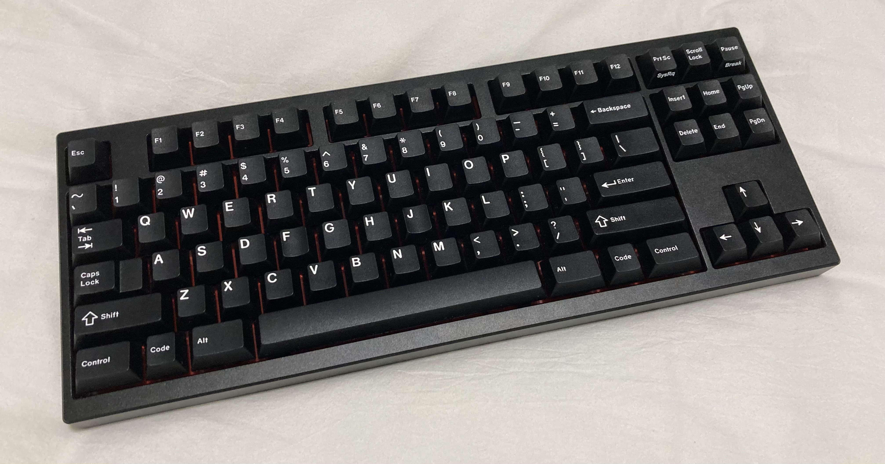
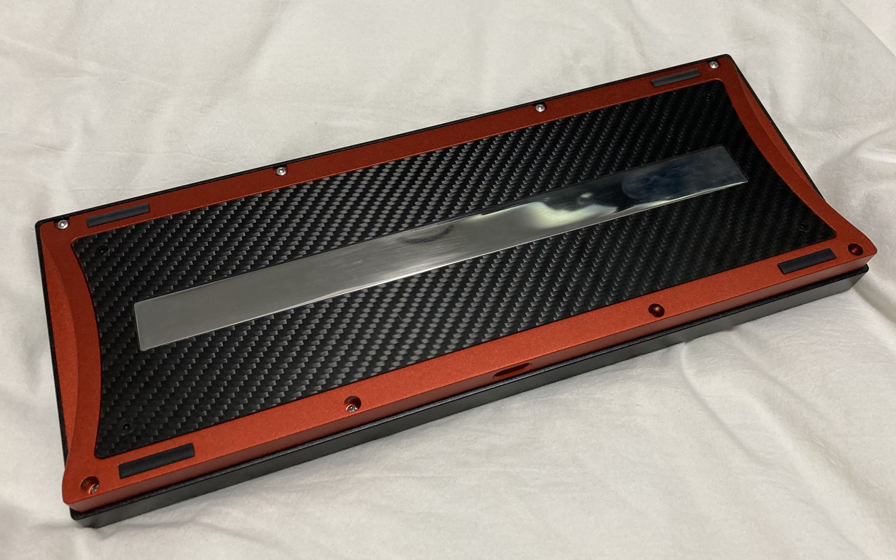

# xyztkl rev1

 

## License

CC0 apart from the switch footprints and component STEP models, see LICENSE.txt.

## Known issues

- The PCB is a bit hard to align
- The steel piece is very long and thin, it may warp during machining

## Parts list

- top
- bottom
- weight-inside: you need two of these, it is already noted in the tech drawing
- weight-outside
- cf-accent: while provided .STEP is 2mm thick, recommend reducing to ~1.8mm so that it looks nicer around the SS accent; countersunk screw holes
- dboard - this uses a custom daughterboard. See notes about JST cable before
- pcb - the included PCB is using STM32F103 (or a compatible clone), you will need an ST-LINK to program the included bootloader; recommend matching the color to the color of the bottom piece if possible
- jst cable: 100mm, reverse orientation (pins 1-4 on one side map to 4-1 on the other) - note that this is the opposite of what ai03 unified daughterboard uses, if you use a wrong cable you risk killing the pcb
